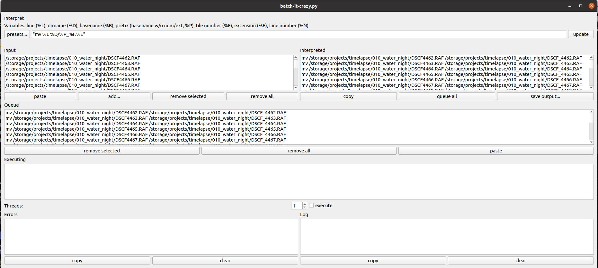

# Batch it crazy

Batch it crazy is a powerful lightweight GUI tool for batch processing multiple files. It has a python-based line interpreter that can be used to automate many tasks such as renaming and processing/converting files.

## UI elements

### Interpret
Here you specify how to process the input lines. Use python to manipulate the input line to create a command you want to execute. The interpreter expects a string in return or a list of strings if you want to output multiple lines per input line.

 There are some variables/shorthands you can use for common path manipulations:
 * line (%L) - the entire input line
 * dirname (%D) - os.path.dirname() from input line
 * basename (%B) - os.path.basename() from input line
 * prefix (basename w/o num/ext, %P) - if your file is "img_123.jpg" then the prefix is "img_"
 * file number (%F) - if your file is "img_123.jpg" then the file number is "123"
 * extension (%E) - if your file is "img_123.jpg" then the extension is "jpg"
 * Line number (%N) - this is the number of the line in the Input list

### Input
Here is a list of lines (file paths, for example) that you want to process. You can paste file names from the clipboard or you can drag and drop files straight from the file explorer.

### Interpreted
This is a list of the Input lines processed by the interpreter. Double check the output before you send it to the execution queue

### Queue
This is where lines wait to be processed. Normally they would be coming from the Processed list but you can also paste/drop commands if you only want to use Batch it crazy for execution.

### Executioner
If the execute checkbox is active, the executioner will take lines from the queue and execute. Multiple commands can be executed simultaneously by increasing the thread value

### Errors/Log
Once a command has been executed, it will be moved here. If the exit code of the process is anything but 0 it goes into the error list, otherwise it goes into the log.

## installation
Batch it crazy requires the following to run:
* Python3 - https://www.python.org/
* PySide2 - https://pypi.org/project/PySide2/

## Configuration
The presets are stored in json-files. If you want to add your own you can either edit the included presets.json file (not recommended) or add your own to the BATCHITCRAZY_PRESETS environment variable (recommended). Multiple preset files are separated by ";"

## Recipes
Here are some useful examples of commands for the interpreter:

* 

* 'dcraw -c 0.0 -4 -T -r 1 1 1 1 -o 6 %L'

* 'mkdir -p %D/%P%F; ffmpeg -i %L -qscale:v 2 %D/%P%F/%P%F.%04d.jpg' (linux only)
This line takes a video file and converts to jpegs that it puts in a subdirectory with the same name as the video file

*

